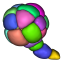

[](https://github.com/ijpb/MorphoLibJ/actions/workflows/build-main.yml)
[](https://zenodo.org/badge/latestdoi/21349/ijpb/MorphoLibJ)

 MorphoLibJ
============

MorphoLibJ is a collection of mathematical morphology methods and plugins for [ImageJ](http://imagej.net/Welcome), 
created at the [INRA-IJPB Modeling and Digital Imaging lab](http://www-ijpb.versailles.inra.fr/en/bc/equipes/modelisation-imagerie/).

The library implements several functionalities that were missing in the ImageJ software, and that were not or only partially covered by other plugins. Namely:

* **Morphological filtering** for 2D/3D and binary or grey level images: erosion & dilation, closing & opening, morphological gradient & Laplacian, top-hat...

* **Morphological reconstruction**, for 2D/3D and binary or grey level images, allowing fast detection of regional or extended extrema, removing of borders, hole filling, attribute filtering...

* **Watershed segmentation** + GUI, making it possible to segment 2D/3D images of (for instance) cell tissues.

* **2D/3D measurements**: photometric (intensity) and morphometric measurements such as volume, surface area, inertia ellipse/ellipsoid...

* **Binary / label images utilities** for removing or keeping largest connected component, perform size opening, fill holes, kill borders...

Installation
------------
* In ImageJ, download the [latest released jar](https://github.com/ijpb/MorphoLibJ/releases) into the _plugins_ folder.

* In Fiji, you just need to add the IJPB-plugins update site:

> 1. Select _Help > Update..._ from the Fiji menu to start the updater.

> 2. Click on _Manage update sites_. This brings up a dialog where you can activate additional update sites.

> 3. Activate the IJPB-plugins update site and close the dialog. Now you should see an additional jar file for download.

> 4. Click _Apply changes_ and restart Fiji.


Develop upon MorphoLibJ
------------

If you develop plugins / applications based on MorphoLibJ, you can use add the following dependency in the maven project configuration file:
```
  <dependency>
    <groupId>fr.inra.ijpb</groupId>
    <artifactId>MorphoLibJ_</artifactId>
    <version>1.6.5</version>
  </dependency>
```

In case the last version of MorphoLibJ is not included in the maven repository,
one workaround is to download the jar file of the last version, 
and to add it to the local maven repository. 
The following command may help (adapt version number as necessary):
```
mvn install:install-file -Dfile=MorphoLibJ_-1.6.5.jar -DgroupId=fr.inra.ijpb -DartifactId=MorphoLibJ_ -Dversion=1.6.5 -Dpackaging=jar -DgeneratePom=true
```

Documentation
-------------

A more detailed presentation of the library and its plugins is available on the [ImageJ/Fiji Wiki](http://imagej.net/MorphoLibJ).
We have as well a [User Manual](https://github.com/ijpb/MorphoLibJ/releases/download/MorphoLibJ_-1.6.5/MorphoLibJ-manual-v1.6.5.pdf) in pdf format.

The library have been presented during several meetings. In particular, it was presented during a [NeuBIAS NEUBIASAcademy@Home webinar](https://www.youtube.com/watch?v=_SiM33C3KcE) in 2020 ([slides are available](https://f1000research.com/slides/9-1378) as well).

The main source code directory is [src/main/java/inra/ijpb](http://github.com/ijpb/MorphoLibJ/tree/master/src/main/java/inra/ijpb). 
You can browse the [javadoc](https://ijpb.github.io/MorphoLibJ/javadoc/index.html) for more information about its API.

Citation
--------
Please note that MorphoLibJ is based on a publication. If you use it successfully for your research please be so kind to cite our work:
* David Legland, Ignacio Arganda-Carreras, Philippe Andrey; [MorphoLibJ: integrated library and plugins for mathematical morphology with ImageJ](http://bioinformatics.oxfordjournals.org/content/early/2016/07/19/bioinformatics.btw413). Bioinformatics 2016; 32 (22): 3532-3534. doi: 10.1093/bioinformatics/btw413

The [MorphoLibJ logo](doc/logo) is available as PNG file in various formats.
